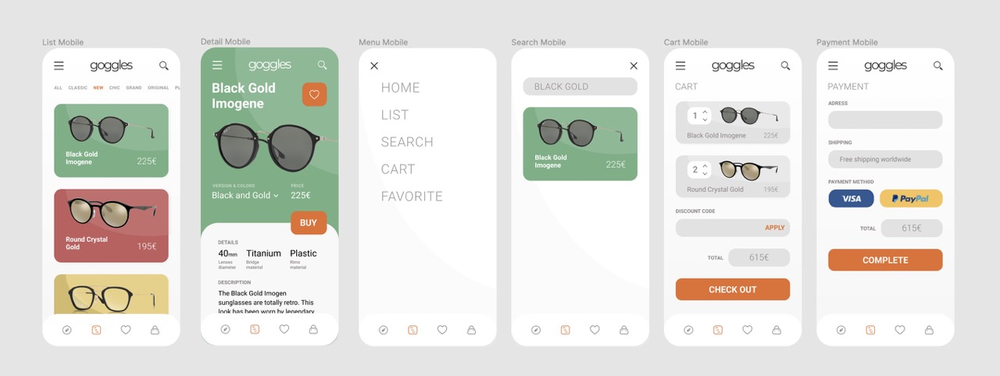

<!DOCTYPE html>
<html lang="es">

<head>
  <meta charset="utf-8">
  <meta name="viewport" content="width=device-width, initial-scale=1, maximum-scale=1">
  <link rel="stylesheet" type="text/css" href="enunciado/dist/prism.css">
  <link rel="stylesheet" type="text/css" href="enunciado/dist/styles.css">
</head>
<body>
  <article class="markdown-body">
    <h1>Práctica 1</h1>
    <nav>
      <ul style="list-style-type: none;">
        <li>Marti Ejarque Galindo</li>
        <li>Rafael Morera Jeeninga</li>
        <li>Victor Xirau Guardans</li>
      </ul>
    </nav>
    <section id="📷">
      <h2>📷 Objetivos</h2>
      
El objetivo del ejercicio consiste en aplicar las principales etiquetas HTML, trabajar
        elementos de la semántica web y añadir los estilos correspondientes.

    </section>
    <section id="📄">
      <h2>📄 Enunciado</h2>
      

        Nuestro equipo de desarrollo a sido seleccionado para implementar un ecommerce de gafas. Para dividir el trabajo
        <b>cada desarrollador del equipo</b> se encargará de implementar el <b>HTML y cSS de un componente</b> de los
        listados
        a
        continuación que forman parte de la página web:
      <ul>
        <li><b>Header: </b>la cabecera con el menú, el logo y el buscador.</li>
        <li><b>Item: </b>los elementos del listado y de detalle.</li>
        <li><b>Cart: </b>la cesta de la compra con sus items y contadores.</li>
        <li><b>Payment: </b>el formulario de pago y envio.</li>
      </ul>
      Los diseñadores UI y el UX del equipo han preparado el siguiente Figma para que podemos ver el <a
        href="https://www.figma.com/file/uoCv37yqBSvvDFjl1k9vAe/PracticaEcommerce?node-id=0%3A1">diseño propuesto </a>
      para
      implementar.
      

      

        
      

    </section>
    <section id="❗">
      <h2>❗ Requisitos</h2>
      

        Es imprescindible seguir las siguientes pautas:
      <ul>
        <li>
          Usar Doctype HTML5 y indicar el idioma del documento.
        </li>
        <li>Codificación de caracteres UTF8.</li>
        <li>Indicar autor, descripción y palabras clave.</li>
        <li>Indicar que los motores de búsqueda indexen la página pero que no sigan los
          enlaces.</li>
        <li>Los iconos deben de ser en formato SVG</li>
        <li>La lectura del contenido y del código debe ser clara (indentation & beautification)</li>
        <li>Utilizar elementos semánticos de primer nivel</li>
        <li>Los estilos deben de ser responsive y adaptarse a todos los tamaños entre las medidas de un iPhone 6 y
          Desktop</li>
        <li>Usar Flexbox y GridLayout</li>
        <li>Usar <a href="https://necolas.github.io/normalize.css/">Normalize</a> o <a
            href="https://gist.github.com/DavidWells/18e73022e723037a50d6">Reset</a></li>
        <li>Los iconos deben de ser en formato SVG y modificar los colores de estos únicamente con el atributo fill
        </li>
        <li>Ficheros y media ordenados en carpetas</li>
        <li>Mobile first: los estilos principales deben de ser para móvil y con mediaqueries ir sobreescribiéndolos
          para tamaños de pantalla mayores.</li>
        <li>Las imágenes tienen que estar optimizadas y en formato PNG</li>
        <li>Implementar el diseño definido por los UI y UX. Se permite modificar el diseño para añadir estilo, siempre y
          cuando el mínimo sea el propuesto.</li>
        <li>Usar mínimo dos transiciones y/o animaciones</li>
        <li>Usar custom properties</li>
        <li>Seguir el formato de entrega</li>
        <li>Los estilos tienen que verse bien en Firefox y Chrome como mínimo</li>
        <li>Formato de entrega</li>
      </ul>
      

    </section>
   
  </article>
</body>

</html>
